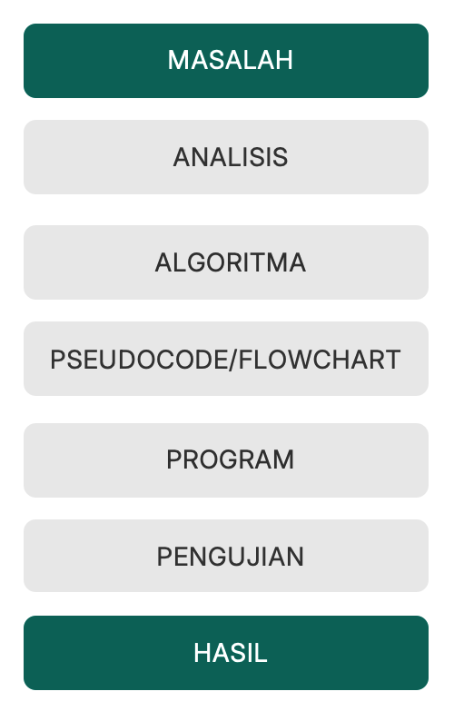
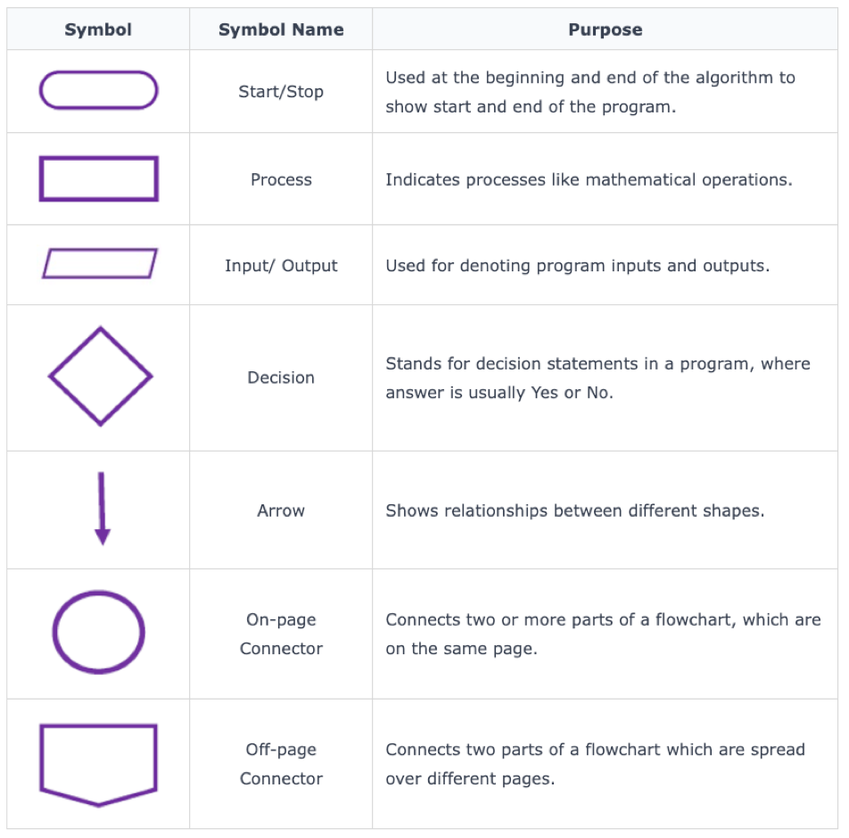

# Capaian Pembelajaran

1. Menjelaskan pengertian dan karakteristik algoritma.
2. Menjelaskan hubungan antara masalah, algoritma, dan program.
3. Menjelaskan fungsi pseudocode dalam merancang solusi.
4. Menuliskan algoritma sederhana menggunakan pseudocode.
5. Menjelaskan fungsi flowchart dalam menggambarkan alur solusi.
6. Mengenali simbol-simbol dasar flowchart.
7. Membuat flowchart untuk menyelesaikan masalah sederhana.
8. Mengubah masalah sehari-hari menjadi langkah-langkah algoritmik yang sistematis.

## Bagaimana komputer menyelesaikan masalah?
Bayangkan komputer diminta:

> "Hitung total belanja pelanggan."

Apa yang harus komputer ketahui?

1. Harga barang?
2. Jumlah barang?
3. Rumus?
4. Urutan proses?
5. Hasil yang harus ditampilkan?

> "Apakah komputer bisa memahami perintah yang terlalu umum seperti manusia?"

## Dari Masalah Menjadi Program




> Program yang baik berawal dari solusi yang jelas.


# Algoritma
## Konsep Dasar Algoritma
Algoritma adalah:

>Serangkaian langkah yang logis, sistematis, dan terstruktur untuk menyelesaikan suatu masalah atau mencapai tujuan tertentu.

Algoritma tidak hanya digunakan dalam pemrograman.

Contoh algoritma dalam kehidupan sehari-hari:

Algoritma membuat kopi:
1. Siapkan gelas.
2. Masukkan kopi.
4. Tambahkan gula.
5. Panaskan air.
6. Tuangkan air panas.
7. Aduk.
8. Kopi siap diminum.

Langkah tersebut memiliki urutan yang jelas.

### Algoritma Di Sekitar_
1. Membuat kopi.
2. Memasak nasi.
3. Mengisi KRS.
4. Login sistem.
5. Memesan makanan.
6. Membayar tagihan.
7. Mencetak dokumen.

## Karakteristik Algoritma
Algoritma memiliki beberapa karakteristik yang penting:
### Input
Algoritma membutuhkan input dari pengguna atau data yang sudah ada untuk menyelesaikan masalah.  
Data yang diperlukan. `panjang`, `lebar`

### Process
Algoritma melakukan proses yang logis dan sistematis untuk menyelesaikan masalah.  
Pengolahan Data. `luas = panjang * lebar`

### Output
Algoritma menghasilkan output yang sesuai dengan tujuan yang ingin dicapai.
Hasil yang diharapkan. `luas`

## Contoh Analisis Masalah
> Sistem ingin menghitung total pembayaran sebuah barang.

Diketahui:
`harga barang, jumlah barang`
### Analisis
#### Input:
harga, jumlah
#### Process:
total = harga × jumlah
#### Output:
total pembayaran

## Langkah-Langkah Menyusun Algoritma
Sebelum membuat algoritma, lakukan:

**Langkah 1** — Identifikasi / pahami masalah

Apa yang ingin diselesaikan?

**Langkah 2** — Tentukan input

Data apa yang diperlukan?

**Langkah 3** — Tentukan proses

Apa yang harus dilakukan terhadap data?

**Langkah 4** — Tentukan output

Apa hasil akhirnya?

**Langkah 5** — Susun langkah penyelesaian 

Tuliskan langkah secara berurutan dengan logis

## Algoritma Sederhana
> Kasus: Menghitung Luas Persegi

Algoritma
1. Mulai. 
2. Masukkan sisi. 
3. Hitung luas = sisi × sisi.
4. Tampilkan luas. 
5. Selesai.

# Pseudocode
Pseudocode adalah cara menuliskan algoritma menggunakan bentuk bahasa sederhana yang menyerupai struktur program

**Tujuan**
1. Merancang solusi.
2. Memeriksa logika.
3. Memudahkan komunikasi.
4. Tidak bergantung pada bahasa pemrograman tertentu.

**Pseudocode ≠ Program**  
Pseudocode belum mengikuti sintaks:
1. Python;
2. Java;
3. C++;
4. dll.

## Struktur Pseudocode
```
START 
INPUT data 
PROCESS data 
OUTPUT hasil 
END

```
Bangun Datar Pesergi
```
START 
INPUT 
sisi 
PROCESS 
luas ← sisi × sisi 
OUTPUT 
luas 
END
```

## Contoh Pseudocode
> Kasus: Menghitung Luas Persegi Panjang

```
PROGRAM HitungLuasPersegiPanjang 

KAMUS 
	panjang, lebar, luas 

PSEUDOCODE
	START
	// INPUT
	INPUT(panjang) 
	INPUT(lebar) 

	// PROSES 
	luas ← panjang * lebar 

	// OUTPUT 
	OUTPUT(luas)
	END
```

> Kasus: Menghitung Rata-Rata Nilai

```
PROGRAM HitungRataRataNilai

KAMUS
  nilai1, nilai2, nilai3, rata 
PSEUDOCODE
	START
	// INPUT
	INPUT(nilai1) 
	INPUT(nilai2) 
	INPUT(nilai3) 

	// PROSES 
	rata ← (nilai1 + nilai2 + nilai3) / 3 

	// OUTPUT 
	OUTPUT(rata)
	END
```

# Flowchart
Flowchart adalah representasi visual dari:
1. langkah algoritma;
2. aliran proses;
3. input/output;
4. proses;
5. keputusan;
6. hubungan antarproses.

**Tujuan**
1. Membuat logika algoritma lebih mudah dilihat dan dipahami.
2. Memudahkan komunikasi dengan tim pengembang.

## Simbol Flowchart



## Syarat Flowchart
1. Flowchart hanya dapat memiliki satu simbol Start dan satu Stop
2. Konektor pada halaman yang sama direferensikan menggunakan angka
3. Konektor di luar halaman direferensikan menggunakan huruf
4. Anak panah tidak boleh saling bersilangan

## Contoh Flowchart Kehidupan Nyata


## Contoh Flowchart Menghitung Rata


# Tugas
## Algoritma
1. Memasak nasi.
2. Mengisi KRS.
3. Memesan makanan.
4. Membayar tagihan.
5. Mencetak dokumen.

## Pseudocode dan Flowchart
1. Menghitung Konversi Suhu (Pilihan Konversi Bebas)
2. Menghitung Total Harga Belanja setelah Diskon Tetap (Tentukan nilai Diskon Tetapnya)

## Ketentuan
1. Dikerjakan secara individu.
2. Flowchart harus menggunakan simbol yang sesuai.
3. Urutan proses harus jelas.
4. Pseudocode harus konsisten dengan flowchart.
5. Kasus harus realistis dan dapat diterjemahkan menjadi program.
