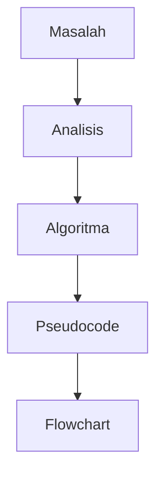
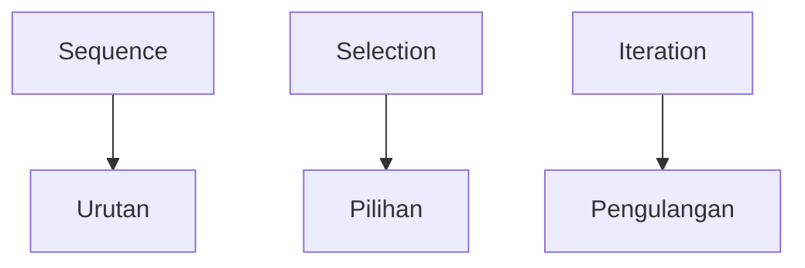
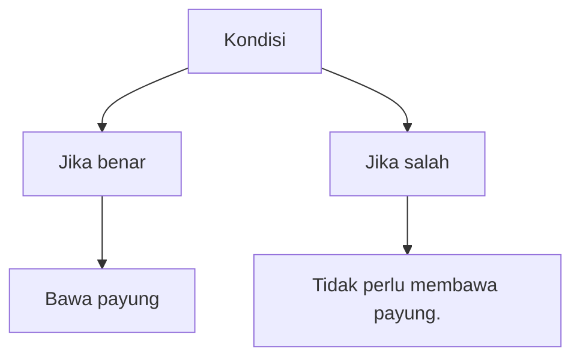

## Universitas Harkat Negeri
### SIF3002 — Dasar Pemrograman

Bima Laksana Putra, S.ST., M.M.

# SEQUENCE, SELECTION, DAN ITERATION

# Capaian Pembelajaran
1. Mengidentifikasi struktur sequence.
2. Mengidentifikasi struktur selection.
3. Mengidentifikasi struktur iteration.
4. Membedakan sequence, selection, dan iteration.
5. Menentukan struktur kontrol yang sesuai berdasarkan karakteristik masalah.
6. Mengidentifikasi struktur kontrol pada pseudocode sederhana.
7. Menjelaskan penerapan struktur kontrol dalam kasus nyata.

## Review Materi Sebelumnya
Apa yang sudah kita pelajari?


**Pertanyaan**  
Apa yang terjadi jika algoritma memiliki:

* keputusan?
* pilihan?
* proses berulang?

**Jawaban**  
Kita membutuhkan struktur kontrol.

# Apa itu Struktur Kontrol?
Struktur kontrol menentukan:

> Bagaimana instruksi program dijalankan.

Secara dasar Algoritma meliputi:


Contoh analogi:
* Sequence = mengikuti rute berurutan.
* Selection = memilih rute.
* Iteration = mengulang rute/proses.

# Sequence
Sequence adalah struktur dimana instruksi dijalankan secara berurutan, dari langkah pertama sampai langkah berikutnya.

**Contoh:**
```
START 
  INPUT nama 
  INPUT umur 
  OUTPUT nama 
  OUTPUT umur 
END
```

**Urutannya:**
```
Input nama
   ↓
Input umur
   ↓
Output nama
   ↓
Output umur
```
> Tidak ada pilihan dan tidak ada pengulangan.

## Contoh Sequence dalam Kehidupan
Proses mencetak dokumen
1. Buka dokumen.
2. Pilih menu Print.
3. Pilih printer.
4. Tentukan jumlah halaman.
5. Klik Print.

Langkah tersebut berjalan secara berurutan.

## Contoh Sequence dalam Sistem Informasi
**Menghitung total transaksi**
```
START

  INPUT harga
  INPUT jumlah
  
  total ← harga × jumlah
  
  OUTPUT total

END
```

**Struktur:**
```
INPUT
 ↓
PROSES
 ↓
OUTPUT
```

> Ini adalah sequence.

# Selection 
Selection adalah struktur kontrol yang digunakan ketika program harus memilih tindakan berdasarkan suatu kondisi.

**Kata kunci:**  
Jika kondisi tertentu terpenuhi, lakukan sesuatu.

Contoh kehidupan:
> Jika hujan, bawa payung.

Kita memiliki:
> Kondisi → Apakah hujan?


## Bentuk Selection 
**IF-ELSE**  
Bentuk dengan dua kemungkinan:
```
IF kondisi THEN
    proses A
ELSE
    proses B
END IF
```
**IF-ELSE IF-ELSE**  
Bentuk dengan tiga atau lebih kemungkinan:
```
IF kondisi THEN
    proses A
ELSE IF kondisi THEN
    proses B
ELSE
    proses C
END IF
```
**SWITCH-CASE**
```
SWITCH 
    CASE kondisi
        proses
    DEFAULT
        proses
END SWITCH
```
Dalam bahasa pemrograman nantinya konsep tersebut dapat diterapkan menggunakan:
```
if
if-else
switch-case
```

## Contoh Selection
### IF-ELSE
Menentukan selection pada sistem login  
**Aturan:**
```
Jika username dan password sesuai
    tampilkan dashboard
Jika tidak
    tampilkan pesan error
```
Pseudocode:
```
START

  INPUT username 
  INPUT password 

  IF data benar THEN 
    tampilkan dashboard
  ELSE
    tampilkan pesan error
  END IF

END
```

### IF-ELSE IF-ELSE
Menentukan selection berdasarkan nilai  
**Aturan:**
```
Jika Nilai >= 90
    A
Jika Nilai >= 80
    B
Jika Nilai >= 70
    C
Jika Nilai >= 60
    D
Jika Nilai < 60
    E
```
Pseudocode:
```
START
  INPUT nilai
  
  IF nilai >= 90 THEN
      OUTPUT "A"
  ELSE IF nilai >= 80 THEN
      OUTPUT "B"
  ELSE IF nilai >= 70 THEN
      OUTPUT "C"
  ELSE IF nilai >= 60 THEN
      OUTPUT "D"
  ELSE
      OUTPUT "E"
  END IF
END
```

### SWITCH-CASE
Menentukan selection berdasarkan pilihan menu  
**Aturan:**
```
  Pilihan Menu 1: Data Mahasiswa
  Pilihan Menu 2: Data Dosen
  Pilihan Menu 3: Data Mata Kuliah
  Pilihan Menu lainnya: Pilihan tidak valid
```
Pseudocode:
```
START

  SWITCH pilihan 
    CASE 1: 
      OUTPUT "Data Mahasiswa"
      
    CASE 2: 
      OUTPUT "Data Dosen"
      
    CASE 3: 
      OUTPUT "Data Mata Kuliah"
      
    DEFAULT: 
      OUTPUT "Pilihan tidak valid"
      
  END SWITCH

END
```
# Iteration
Iteration adalah struktur kontrol untuk mengulangi suatu proses selama kondisi tertentu terpenuhi atau sampai kondisi tertentu tercapai.

**Kata kunci:**

>Ulangi.

**Contoh kehidupan:**

>Ulangi membaca materi sampai memahami materi.

## Contoh Iteration
Misalnya kita ingin menampilkan angka:
```
1
2
3
4
5
```
Daripada menuliskan:
```
OUTPUT 1
OUTPUT 2
OUTPUT 3
OUTPUT 4
OUTPUT 5
```
kita dapat menggunakan pengulangan.
```
Pseudocode:

START

  FOR i ← 1 TO 5
      OUTPUT i
  END FOR

END
```
## Mengapa Menggunakan Iteration
Bayangkan sistem harus memproses:

>10 mahasiswa

atau:

>1.000 mahasiswa

atau:

>100.000 transaksi

Menulis proses satu per satu:
```
proses mahasiswa 1
proses mahasiswa 2
proses mahasiswa 3
...
proses mahasiswa 100000
```
tidak efisien.

**Solusi:**
>Iteration / Loop

## Jenis Iteration
