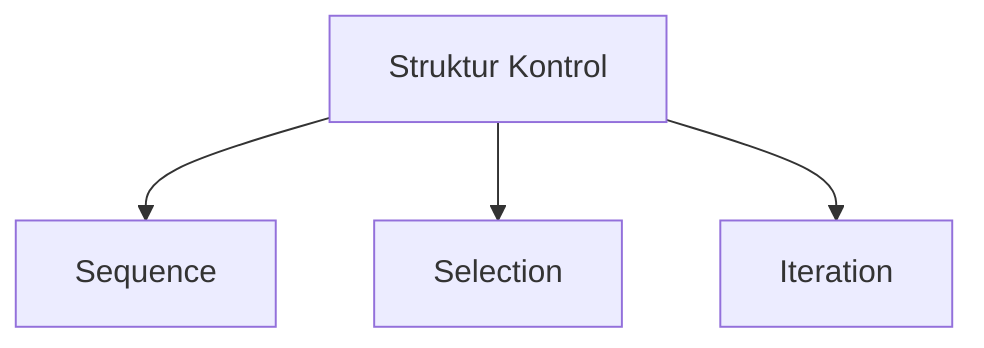
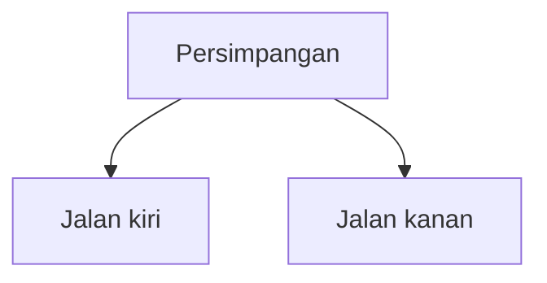
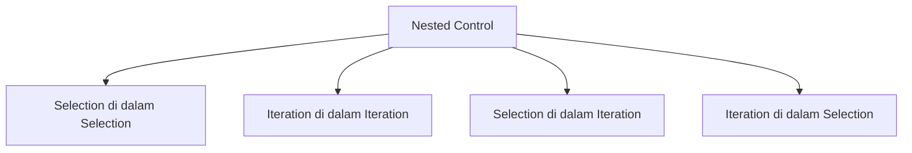
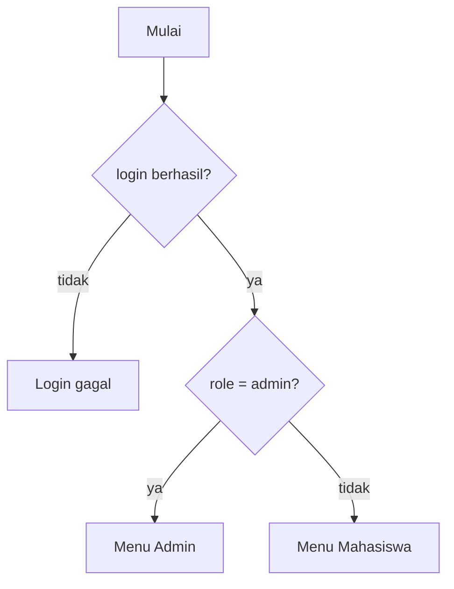
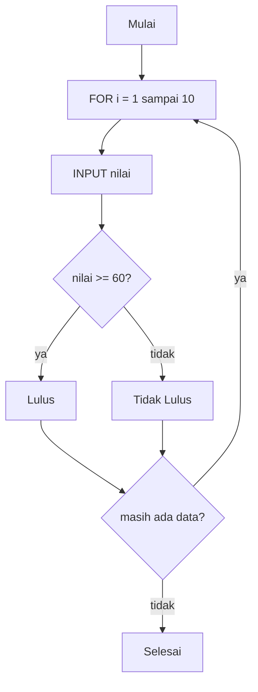

## Universitas Harkat Negeri
### SIF3002 — Dasar Pemrograman

Bima Laksana Putra, S.ST., M.M.

# Perbandingan Selection VS Iteration, Nested Control, dan Pemilihan Struktur Kontrol


# Capaian Pembelajaran

1. Membandingkan karakteristik struktur selection dan iteration.
2. Menjelaskan kapan menggunakan selection dan kapan menggunakan iteration.
3. Menjelaskan konsep struktur kontrol bertingkat (nested control).
4. Mengidentifikasi struktur kontrol bertingkat pada pseudocode.
5. Menentukan struktur kontrol yang paling tepat untuk suatu kasus.
6. Menyusun pseudocode yang memuat kombinasi beberapa struktur kontrol.

## Review Materi Sebelumnya

Pada pertemuan sebelumnya kita telah mempelajari tiga struktur kontrol dasar:



| Struktur | Fungsi | Ciri Utama |
| ---- | ---- | ---- |
| Sequence | Menjalankan langkah berurutan | Tidak ada pilihan/pengulangan |
| Selection | Memilih berdasarkan kondisi | Ada keputusan |
| Iteration | Mengulangi proses | Ada pengulangan |

Cara sederhana mengingat:

**SEQUENCE** (Urutan)
> Lakukan A → B → C

**SELECTION** (Pilihan)
> Jika kondisi → pilih A/B

**ITERATION** (Pengulangan)
> Ulangi A sampai kondisi tertentu

**Pertanyaan kunci pertemuan ini:**
> Bagaimana membedakan selection dan iteration dengan tepat, serta bagaimana menggabungkan beberapa struktur kontrol dalam satu program?

# Selection vs Iteration

Selection dan iteration adalah dua struktur kontrol yang sering tertukar. Padahal keduanya menyelesaikan masalah yang berbeda.

## Konsep Dasar

**Selection** memilih **satu** di antara beberapa kemungkinan berdasarkan kondisi.

> Satu keputusan, satu kali jalan.

**Iteration** mengulangi proses yang **sama** beberapa kali.

> Satu proses, diulang berkali-kali.

## Analogi

Selection ibarat di persimpangan jalan:



> Kita memilih **salah satu** jalan, lalu jalan terus.

Iteration ibarat berlari mengelilingi lapangan:

> Kita **mengulang** putaran yang sama sebanyak 5 kali.

## Perbandingan Selection vs Iteration

| Aspek | Selection | Iteration |
| ---- | ---- | ---- |
| Fungsi | Memilih satu cabang | Mengulang proses |
| Jumlah eksekusi | Satu kali (satu cabang terpilih) | Berulang (berkali-kali) |
| Pemicu | Kondisi keputusan | Kondisi berhenti / jumlah pengulangan |
| Kata kunci | "jika", "pilih", "apabila" | "ulangi", "selama", "sampai" |
| Bentuk | `if-else`, `switch-case` | `for`, `while`, `do-while` |
| Contoh | Jika hujan → bawa payung | Ulangi membaca sampai paham |

## Kapan Menggunakan Selection?

Gunakan selection ketika program harus **memutuskan**:

1. Apakah mahasiswa lulus atau tidak.
2. Menentukan grade berdasarkan nilai.
3. Memilih menu berdasarkan input.
4. Menentukan diskon berdasarkan total belanja.

## Kapan Menggunakan Iteration?

Gunakan iteration ketika program harus **mengulang**:

1. Menampilkan angka 1 sampai 100.
2. Memproses data banyak mahasiswa.
3. Mengulang input password sampai benar.
4. Menjumlahkan seluruh barang dalam keranjang.

## Kesalahan Umum

1. **Menggunakan iteration untuk memilih.** Misalnya, membuat loop untuk menentukan grade — seharusnya cukup selection.
2. **Menggunakan selection untuk mengulang.** Selection tidak dapat mengulang; satu `if` hanya dijalankan satu kali.
3. **Mengira `if-else` bisa memproses banyak data sekaligus.** Untuk memproses banyak data, gunakan iteration, bukan menulis banyak `if`.

# Nested Control (Struktur Kontrol Bertingkat)

## Pengertian

Nested control adalah **struktur kontrol di dalam struktur kontrol**.

Program nyata jarang hanya menggunakan satu struktur. Umumnya kita **menggabungkan** atau **menyusun bertingkat** beberapa struktur.



## Nested Selection

Selection di dalam selection: keputusan kedua hanya dijalankan jika keputusan pertama terpenuhi.

**Kasus: Sistem Login dengan Role**

```
START

  INPUT username
  INPUT password

  IF login berhasil THEN
      IF role = "admin" THEN
          OUTPUT "Menu Admin"
      ELSE
          OUTPUT "Menu Mahasiswa"
      END IF
  ELSE
      OUTPUT "Login gagal"
  END IF

END
```

Penjelasan:

* Keputusan pertama: apakah login berhasil?
* Keputusan kedua (di dalam `IF` pertama): apakah role admin atau mahasiswa?
* Jika login gagal, keputusan kedua tidak pernah dijalankan.



## Nested Iteration

Iteration di dalam iteration: loop dalam akan dijalankan penuh untuk setiap satu langkah loop luar.

**Kasus: Tabel Perkalian 1–3**

```
START

  FOR i ← 1 TO 3
      FOR j ← 1 TO 4
          OUTPUT i × j
      END FOR
  END FOR

END
```

**Cara kerja:**

```
i = 1 → j = 1, 2, 3, 4
i = 2 → j = 1, 2, 3, 4
i = 3 → j = 1, 2, 3, 4
```

> Setiap satu kali loop luar berjalan, loop dalam berjalan penuh.

## Selection di dalam Iteration

Ini adalah pola yang paling sering muncul: mengulang banyak data, lalu **memutuskan sesuatu untuk setiap data**.

**Kasus: Memproses Nilai 10 Mahasiswa**

```
START

  FOR i ← 1 TO 10
      INPUT nilai
      IF nilai >= 60 THEN
          OUTPUT "Lulus"
      ELSE
          OUTPUT "Tidak Lulus"
      END IF
  END FOR

END
```

> Loop mengulang proses, sedangkan `IF` memutuskan kelulusan untuk tiap mahasiswa.



## Iteration di dalam Selection

Iteration berada di dalam salah satu cabang selection.

**Kasus: Admin Melihat Seluruh Data**

```
START

  INPUT peran

  IF peran = "admin" THEN
      FOR i ← 1 TO jumlah_data
          OUTPUT data[i]
      END FOR
  ELSE
      OUTPUT "Akses terbatas"
  END IF

END
```

> Hanya admin yang melakukan pengulangan menampilkan data.

## Pentingnya Indentasi

Indentasi (penulisan menjorok ke dalam) sangat penting pada nested control.

**Tanpa indentasi (sulit dibaca):**
```
IF a THEN
IF b THEN
proses 1
ELSE
proses 2
END IF
END IF
```

**Dengan indentasi (mudah dibaca):**
```
IF a THEN
    IF b THEN
        proses 1
    ELSE
        proses 2
    END IF
END IF
```

> Indentasi membantu kita (dan orang lain) memahami struktur bertingkat tanpa menghitung kurung atau kata kunci.

# Pemilihan Struktur Kontrol untuk Kasus Tertentu

## Langkah Memilih Struktur Kontrol

Gunakan langkah berikut sebelum menulis pseudocode:

1. **Pahami masalah** — apa yang ingin diselesaikan?
2. **Ada keputusan?** → gunakan selection.
3. **Ada pengulangan?** → gunakan iteration.
4. **Pengulangan di dalam keputusan, atau sebaliknya?** → gunakan nested control.
5. **Tentukan bentuk spesifiknya** (`if-else` vs `switch`, `for` vs `while` vs `do-while`).

## Panduan Cepat

| Kondisi Masalah | Struktur | Bentuk yang Cocok |
| ---- | ---- | ---- |
| Satu keputusan, dua cabang | Selection | `if-else` |
| Banyak cabang nilai pasti | Selection | `switch-case` |
| Keputusan bertingkat / rentang | Selection | `if-else if-else` |
| Jumlah pengulangan diketahui | Iteration | `for` |
| Pengulangan sampai kondisi terpenuhi | Iteration | `while` |
| Proses minimal dijalankan satu kali | Iteration | `do-while` |
| Keputusan di dalam keputusan | Nested | `if` di dalam `if` |
| Proses berulang + keputusan tiap item | Nested | loop + `if` |

## Pola Umum dalam Program

Beberapa kasus hampir selalu menggunakan pola yang sama:

### Validasi Input

Pengguna harus memasukkan data yang benar. Proses diulang sampai valid.

```
DO
    INPUT data
WHILE data tidak valid
```

### Menu Program

Menu ditampilkan berulang sampai pengguna memilih keluar.

```
DO
    tampilkan menu
    INPUT pilihan
    SWITCH pilihan
        CASE 1: proses A
        CASE 2: proses B
        DEFAULT: pesan tidak valid
    END SWITCH
WHILE pilihan != keluar
```

### Iterasi Koleksi Data

Memproses seluruh data dengan jumlah yang diketahui.

```
FOR i ← 1 TO jumlah_data
    proses data[i]
END FOR
```

### Klasifikasi Berjenjang

Menentukan kategori dari suatu rentang nilai.

```
IF nilai >= 90 THEN
    grade = "A"
ELSE IF nilai >= 80 THEN
    grade = "B"
ELSE
    grade = "C"
END IF
```

## Studi Kasus Lengkap: Sistem Kasir Sederhana

Gabungkan beberapa struktur kontrol dalam satu program.

**Aturan:**

1. Tampilkan menu dan minta pilihan (validasi).
2. Input harga dan jumlah untuk setiap barang.
3. Hitung subtotal dan akumulasi total.
4. Jika total lebih dari Rp500.000, berikan diskon 10%.
5. Tampilkan total akhir.

**Pseudocode:**

```
START

  // Validasi pilihan menu
  DO
      tampilkan menu
      INPUT pilihan
  WHILE pilihan tidak valid

  total ← 0

  // Iterasi seluruh barang
  FOR i ← 1 TO jumlah_barang
      INPUT harga
      INPUT jumlah
      subtotal ← harga × jumlah
      total ← total + subtotal
  END FOR

  // Selection diskon
  IF total > 500000 THEN
      diskon ← total × 0.10
      total ← total - diskon
  END IF

  OUTPUT total

END
```

**Identifikasi struktur:**

| Bagian | Struktur |
| ---- | ---- |
| Validasi menu | Iteration (`do-while`) |
| Input & hitung tiap barang | Iteration (`for`) |
| Cek diskon | Selection (`if`) |

> Satu program dapat menggabungkan sequence, selection, dan iteration sekaligus.

## Studi Kasus: Sistem Absensi dengan Batas Percobaan

**Aturan:**

1. Maksimal 3 kali percobaan absensi.
2. Setiap percobaan, input NIM.
3. Jika NIM ditemukan → simpan absensi, selesai.
4. Jika tidak ditemukan → kurangi sisa percobaan.
5. Jika percobaan habis → tampilkan pesan gagal.

**Pseudocode:**

```
START

  sisa ← 3
  ketemu ← FALSE

  WHILE sisa > 0 AND NOT ketemu
      INPUT nim
      IF nim ditemukan THEN
          simpan absensi
          ketemu ← TRUE
      ELSE
          sisa ← sisa - 1
          OUTPUT "NIM tidak ditemukan"
      END IF
  END WHILE

  IF NOT ketemu THEN
      OUTPUT "Percobaan habis"
  END IF

END
```

> Di sini ada iteration (`while`) yang di dalamnya ada selection (`if`), lalu selection terakhir untuk menentukan hasil.

# Kuis Cepat

Tentukan struktur kontrol yang paling tepat untuk kasus berikut:

Kasus A
> Menampilkan tabel perkalian 1 sampai 10.

Kasus B
> Menentukan grade mahasiswa dari nilai akhir.

Kasus C
> Meminta input PIN ATM sampai PIN benar (maksimal 3 kali).

Kasus D
> Menghitung total gaji karyawan, dengan lembur jika jam kerja > 40.

Kasus E
> Menampilkan seluruh mahasiswa yang berstatus lulus.

Kasus F
> Menampilkan menu utama berulang sampai pengguna memilih keluar.

# Tugas

## Analisis Struktur Kontrol

Untuk setiap kasus berikut, tentukan struktur kontrol yang digunakan (sequence, selection, iteration, atau nested) beserta alasannya:

1. Sistem Pemesanan Tiket Bioskop.
2. Sistem Pendaftaran Mahasiswa Baru.
3. Sistem Peminjaman Buku Perpustakaan.

## Pseudocode Nested Control

Pilih **2** kasus dari daftar di atas, lalu buat pseudocode yang memuat **minimal satu nested control** (selection di dalam iteration, atau iteration di dalam selection).

## Ketentuan

1. Dikerjakan secara individu.
2. Identifikasi struktur kontrol harus disertai alasan singkat.
3. Pseudocode harus menggunakan indentasi yang benar.
4. Kasus harus realistis dan dapat diterjemahkan menjadi program.
5. Pseudocode harus menggabungkan setidaknya dua struktur kontrol yang berbeda.
